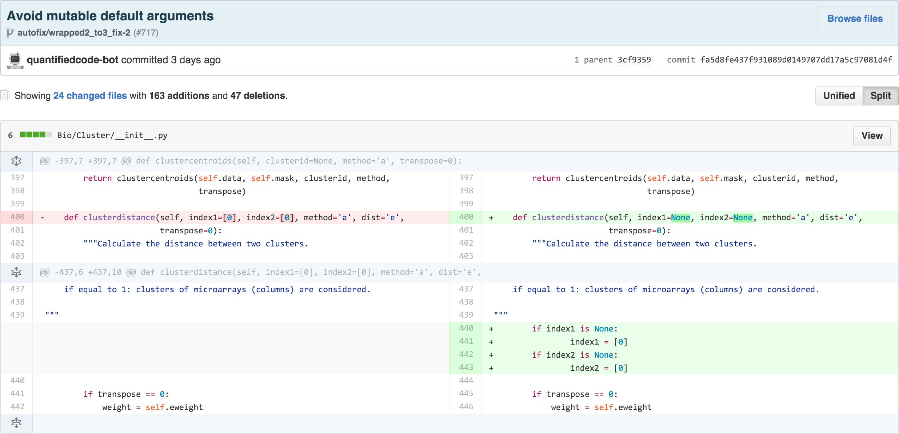
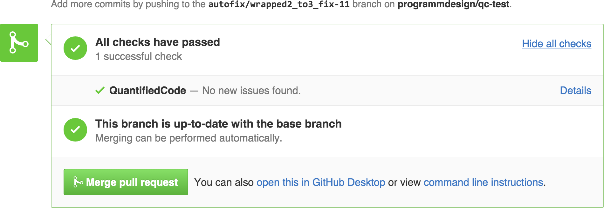
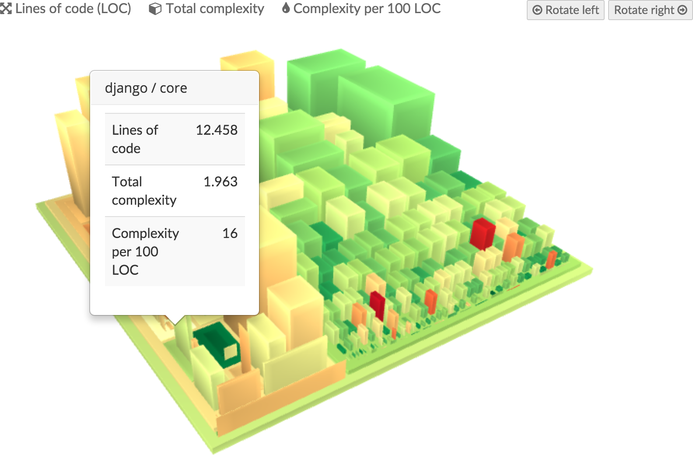
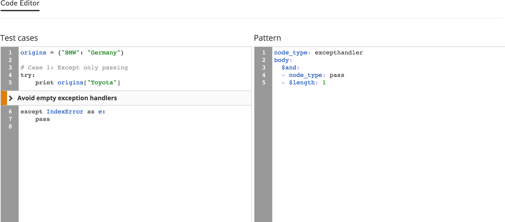

QuantifiedCode is first code quality platform for Python that fixes issues, instead of just reporting them. It continuously monitors all your Commits and Pull Request for more than 200 quality issues, notifies you about problems and automatically offers refactorings that improve your code.

### Fix quality issues automatically

Save hours of manual work by automatically fixing quality issues. Cody, your code-quality bot, automatically suggests refactorings and delivers them as GitHub Pull Request or as Patch via email. 

[How it works](https://www.quantifiedcode.com/how-it-works) • [Example](https://www.github.com/programmdesign/biopython/pulls) • [Video](https://youtu.be/rSkmnFVXjgY)

#### Automate your code reviews

Continuously monitor all your Commits and Pull Requests for more than 200 code quality rules. QuantifiedCode supports Python, as well as popular frameworks like Django or Flask. Incremental analyses make your builds super fast and enterprise-grade type-inference and data-flow analyses ensure your code stays safe and sound.

### Identify complex code

Larger software projects code can quickly get complex. Use QuantifiedCode's 3D software maps to instantaniously identify complexity hotspots that require thorough documentation or a rewrite.

### Enforce your own quality standards

Why search and discuss a code issues more than once? Use QuantifiedCode's Code Check Editor to "record" your issues you discover in manual reviews or use it to codify and enfore your own architecture or quality standards. Creating a check takes only minutes and is as simple as writing a query. [Learn more](http://docs.quantifiedcode.com/patterns/language/index.html)

### Free for Open Source

QuantifiedCode is free for open source projects.

### Enterprise Edition

[Contact](https://www.quantifiedcode.com/contact) QuantifiedCode, if you'd like to run their solution behind your firewall.
