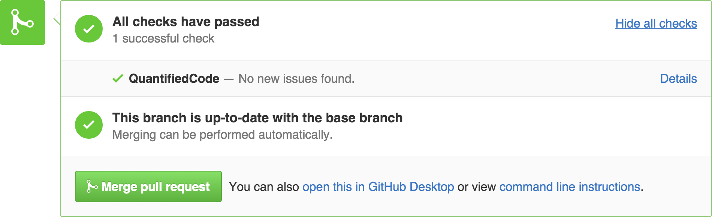
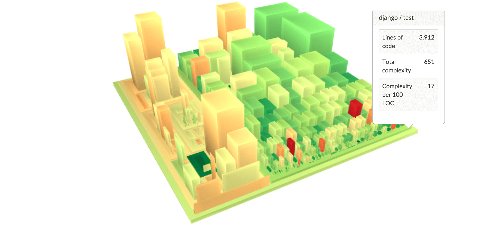

QuantifiedCode is the first code quality platform that fixes issues, instead of just reporting them. It continuously monitors all your commits and pull request for hundreds of quality rules, notifies you about problems and automatically offers refactorings that improve your code. Currently, QuantifiedCode supports in Python.

### Features
#### Fix quality issues automatically

Save hours of manual work by automatically fixing quality issues. Cody, the code-quality bot, automatically suggests refactorings and delivers them as GitHub pull request or as patch via email. 

[How it works](https://www.quantifiedcode.com/how-it-works) • [Example](https://www.github.com/programmdesign/biopython/pulls) • [Video](https://youtu.be/rSkmnFVXjgY)

#### Automate your code reviews

Continuously monitor all your Commits and Pull Requests for hundreds of code quality rules. QuantifiedCode supports Python, as well as popular frameworks like Django or Flask. Incremental analyses make your builds super fast and type-inference and data-flow analysis ensure your code stays safe and sound.

#### Identify complex code

Larger software projects code can quickly grow complex. Use QuantifiedCode's 3D software maps to instantly identify complexity hot spots that require thorough documentation or a rewrite.

#### Enforce your own quality standards

Why search and discuss a code issue more than once? Use QuantifiedCode's code check editor to "record" issues you discover in manual reviews or use it to codify and enfore your own architecture or quality standards. Creating a check takes only minutes and is as simple as writing a query. [Learn more](http://docs.quantifiedcode.com/patterns/language/index.html)

### Free for Open Source

QuantifiedCode is free for Open Source projects. Business users can try the service 14 days for free.

### Enterprise Edition

[Contact](https://www.quantifiedcode.com/contact) QuantifiedCode, if you'd like to run their solution behind your firewall.
